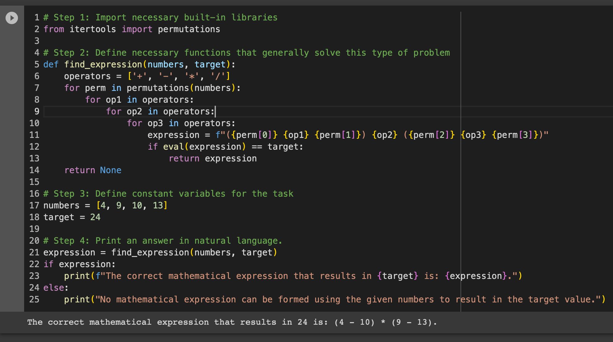
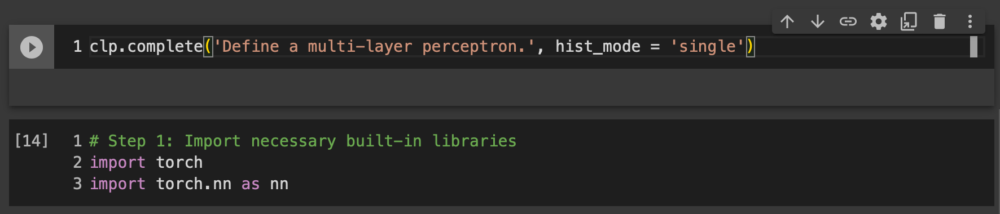
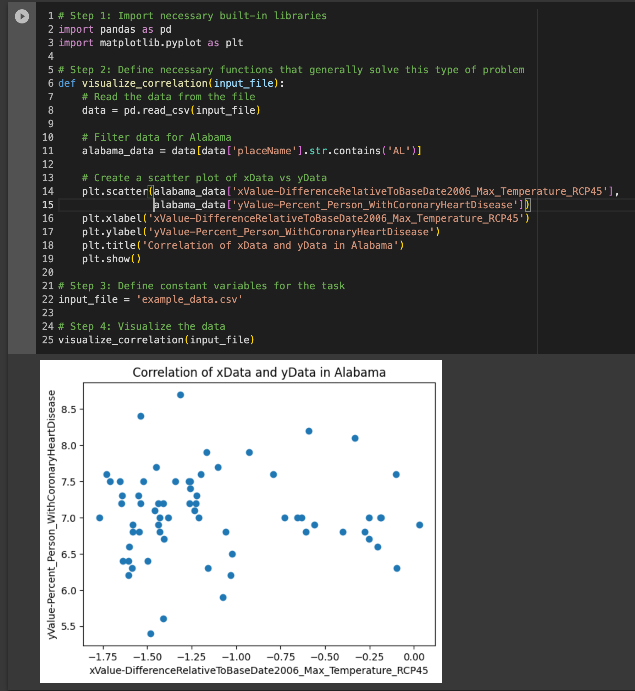

# LangCode - Enable NLEP Reasoning for LLMs
- Implementation and iPython toolkit for the paper [Natural Language Embedded Programs for Hybrid Language Symbolic Reasoning](https://arxiv.org/pdf/2309.10814.pdf).
- Improved interpretability and problem solving ability with **natural language embedded programs (NLEP)**, a hybrid language-symbolic reasoning technique.
- Multi-round, interactive, smooth programming on Colab and Jupyter notebook.

<div align="center">


Respresenting the Language of Thought

[Hongyin Luo](https://luohongyin.github.io/) @ MIT *[hyluo at mit dot edu]*

</div>

## NLEP: Natural Language Embedded Programming
The auto-regressive large language models (LLMs) generate natural and programming languages by scoring the next tokens, sampling flexible but undeterministic texts.

The Python interpreter reads structured source code and output mostly *deterministic* results, ensuring the mathematical correctness in reasoning and computation based on the given Python code.

`NLEP` is an end-to-end, hybrid language-symbolic framework with an LLM and a code interpreter.
- LLM plans for the reasoning by generating step-by-step programs.
- Code interpreter executes the generated program and prints desired responses.
- No further edition needed for program standard outputs.

`NLEP` can deal with natural language, math, symbolic, and programming tasks.
<details>
<summary>Game of 24 Example</summary>

- Instruction: `What is the correct mathematical expression consisting of the numbers {4, 9, 10, 13} in any order, along with the parentheses and arithmetic operations that results in 24?`
- Program generated by LLM
```python
# Step 1: Import necessary built-in libraries
import itertools
import operator

# Step 2: Define necessary functions that generally solve this type of problem
def find_expression(numbers, target):
    operations = [operator.add, operator.sub, operator.mul, operator.truediv]
    ops = {operator.add: '+', operator.sub: '-', operator.mul: '*', operator.truediv: '/'}

    for permutation in itertools.permutations(numbers):
        for ops_combo in itertools.product(operations, repeat=len(numbers)-1):
            expression = f"({permutation[0]} {ops[ops_combo[0]]} {permutation[1]})"
            for i in range(2, len(numbers)):
                expression = f"({expression} {ops[ops_combo[i-1]]} {permutation[i]})"
            try:
                if eval(expression) == target:
                    return expression.replace("/", "//")
            except ZeroDivisionError:
                continue
    return None

# Step 3: Define constant variables for the task
numbers = [4, 9, 10, 13]
target = 24

# Step 4: Print an answer in natural language.
expression = find_expression(numbers, target)
if expression:
    print(f"The correct mathematical expression that results in 24 is {expression}.")
else:
    print("There is no correct mathematical expression that results in 24 using these numbers.")
```

- Result: `The correct mathematical expression that results in 24 is (((9 + 10) - 13) * 4).`

</details>
<details>
<summary>Question answering example</summary>

- Instruction: `How many keystrokes are needed to type the numbers from 1 to 104892?`
- Program generated by LLM
```python
# Step 1: Import necessary built-in libraries
# No need to import

# Step 2: Define necessary functions that generally solve this type of problem
def calculate_keystrokes(number):
    keystrokes = 0
    for i in range(1, number + 1):
        keystrokes += len(str(i))
    return keystrokes

# Step 3: Define constant variables for the task
number = 104892

# Step 4: Print an answer in natural language.
keystrokes = calculate_keystrokes(number)
print(f"To type the numbers from 1 to {number}, {keystrokes} keystrokes are needed.")
```
- Result: `To type the numbers from 1 to 104892, 518247 keystrokes are needed.`
</details>
<details>
<summary>Pytorch programming example</summary>

- Instruction: `Build a multi-layer perceptron with two hiden states and dropout in Pytorch.`
- Program generated by LLM
```python
# Step 1: Import necessary built-in libraries
import torch
import torch.nn as nn
import torch.nn.functional as F

# Step 2: Define necessary classes that generally solve this type of problem
class MultiLayerPerceptron(nn.Module):
    def __init__(self, input_size, hidden_size1, hidden_size2, num_classes, dropout_rate):
        super(MultiLayerPerceptron, self).__init__()
        self.fc1 = nn.Linear(input_size, hidden_size1)
        self.fc2 = nn.Linear(hidden_size1, hidden_size2)
        self.fc3 = nn.Linear(hidden_size2, num_classes)
        self.dropout = nn.Dropout(dropout_rate)

    def forward(self, x):
        out = F.relu(self.fc1(x))
        out = self.dropout(out)
        out = F.relu(self.fc2(out))
        out = self.dropout(out)
        out = self.fc3(out)
        return out

# Step 3: Define constant variables for the task
input_size = 784 # 28x28 pixels for MNIST dataset
hidden_size1 = 500
hidden_size2 = 100
num_classes = 10 # 10 digits for MNIST dataset
dropout_rate = 0.5

# Step 4: Instantiate the network
net = MultiLayerPerceptron(input_size, hidden_size1, hidden_size2, num_classes, dropout_rate)

# Print out the network architecture
print(net)
```
- Result
```
MultiLayerPerceptron(
  (fc1): Linear(in_features=784, out_features=500, bias=True)
  (fc2): Linear(in_features=500, out_features=100, bias=True)
  (fc3): Linear(in_features=100, out_features=10, bias=True)
  (dropout): Dropout(p=0.5, inplace=False)
)
```

</details>
<details>
<summary>Multi-turn conversation example</summary>

- Instruction 1: `who is the first emperor of the Tang dynasty?`
- First program generated by LLM
```python
# Step 1: Import necessary built-in libraries
# No need to import

# Step 2: Define necessary functions that generally solve this type of problem
# No need to define a function

# Step 3: Define constant variables for the task
first_emperor_tang_dynasty = "Emperor Gaozu"

# Step 4: Print an answer in natural language.
print(f"The first emperor of the Tang dynasty is {first_emperor_tang_dynasty}.")
```
- Result 1: `The first emperor of the Tang dynasty is Emperor Gaozu.`
- Instruction 2: `Tell me more about him.`
- Second program generated by LLM
```python
# Step 1: Import necessary built-in libraries
# No need to import

# Step 2: Define necessary functions that generally solve this type of problem
# No need to define a function

# Step 3: Define constant variables for the task
first_emperor_tang_dynasty_info = {
    "name": "Emperor Gaozu",
    "born": "566",
    "died": "635",
    "reign": "618-626",
    "full_name": "Li Yuan",
    "era_name": "Wude",
    "children": "27, including Emperor Taizong",
    "notable_events": "founded the Tang dynasty, expanded the empire, implemented policies promoting economic prosperity and cultural innovation"
}

# Step 4: Print an answer in natural language.
print(f"Emperor Gaozu, born in the year {first_emperor_tang_dynasty_info['born']} and died in the year {first_emperor_tang_dynasty_info['died']}, was the first emperor of the Tang dynasty. His reign, from {first_emperor_tang_dynasty_info['reign']}, is known as the Wude era. His given name was Li Yuan. He had 27 children, including his successor, Emperor Taizong. During his reign, he not only founded the Tang dynasty but also expanded the empire and implemented policies that promoted economic prosperity and cultural innovation.")
```
- Result 2: `Emperor Gaozu, born in the year 566 and died in the year 635, was the first emperor of the Tang dynasty. His reign, from 618-626, is known as the Wude era. His given name was Li Yuan. He had 27 children, including his successor, Emperor Taizong. During his reign, he not only founded the Tang dynasty but also expanded the empire and implemented policies that promoted economic prosperity and cultural innovation.`

</details>

## Contents
- [Supported Environments](#supported-environments)
- [Config API Endpoint](#config-api-endpoint)
- [Quick Start with Colab](#quick-start-with-colab)
    - [Installation](#installation)
    - [Define LangPy agent](#define-langpy-agent)
    - [Code generation](#generated-code-to-answer-any-question)
    - [Run generated code](#run-the-generated-code)
    - [Code completion](#code-completion)
    - [CSV file processing](#csv-file-processing)
- [Chat with Python by Code Generation](#chat-with-python-through-code-generation)
- [Hirarchical Instructng by Code Completion](#hirarchical-instruction-following-through-code-completion)
- [Contact](#contact)

## Supported Environments
- [Option 1] `Colab` - Recommended! you are already good to go!
    - [Example Colab notebook](https://colab.research.google.com/drive/132vl1t3MJlq8ekzMNycGejvBTcwoDcDM?usp=sharing) might be helpfu!
- [Option 2] `Jupyter notebook 6.X` deployment
    - [Create a conda enviroment and launch Jupyter notebook](documents/conda_jupyter.md)
- LangCode does not work in vscode for now.

## Customizing NLEP Generation API
By default, we provide an API server that generates NLEPs without saving users' API keys. We will continue improving the prompt strategy and the quality of generated NELPs. However, we provide an option for customized servers.

Please refer to [LangCode/server/](https://github.com/luohongyin/LangCode/tree/main/server) for the server setup. We provide complete code and minimal prompt to generate high-quality NLEP for different tasks. Use the following command to switch to the preferred server.
```python
clp.config_api_endpoint()
# Then input your server url in the following format:
# http://{HOSTNAME}:{PORT}/items/0
```

Our server timeouts at 30s since the GPT-4 API is not efficient enough, but the custom server we provide does not involve this limitation.

## Quick Start with Colab

### Installation
Install the LangCode package in the IPython notebook by runing the following command in a code cell.
```bash
!pip install langpy-notebook
```
As an early release, we first deal with the `Python` programming language and release the `LangPy` class. We also look forward to `LangJulia`, `LangR`, `LangGo`, etc.

### Define LangPy agent
Import the library and define a Langpy agent. The `langpy.auto.get_langpy` function automatically identify if the backend is Jupyter 6 or Colab.
```python
from langpy.auto import get_langpy

# clp: an instance of ColabLangPy
clp = get_langpy(
    api_key='YOUR-API-KEY',
    platform='gpt',
    model='gpt-4'
)
```
The platforms we support are `gpt` (OpenAI) and `palm` (Google), and you can select models on these platforms. For example, `platform='palm',model='text-bison-001'` uses Google's `text-bison-001`.

### Generated code to answer *any* question
Add the following code to a code cell, and run it to generate a program that answers your question. For example, the **Game of 24** task.

```python
# mode: control history reading to enable multi-turn programming

# hist_mode = 'all' (default)        -> read all cell history
# hist_mode = 'single'               -> only read the current instruction
# hist_mode = INTERGER               -> Read {INTEGER} history cells.
# hist_mode = 0 is equivalent to hist_mode = 'single'

numbers = '{4, 9, 10, 13}'
target = 24
clp.generate(
    f'What is the correct mathematical expression consisting of the numbers {numbers} in any order, along with the parentheses and arithmetic operations that results in {target}?',
    hist_mode = 'single'
)
```
The generated program would be placed in
- in a scratch cell (Colab), or
- the next code cell (Jupyter notebook 6)

### Run the generated Code
Run the generated code, you'll get the answer in **natural language**



We did not use any Game of 24 example to prompt GPT-4, but it still gets the correct answer `(4 - 10) * (9 - 13)` with only sampling **one** output! This is more efficient than tree-of-thoughts.

### Code Completion
The `LangPy` agent can also complete code that is not finished yet.

Run the code in the upper cell will complete the code in the lower cell, getting the following program
```python
# Step 1: Import necessary built-in libraries
import torch
import torch.nn as nn

# Step 2: Define necessary functions that generally solve this type of problem
class MLP(nn.Module):
    def __init__(self):
        super(MLP, self).__init__()
        self.layers = nn.Sequential(
            nn.Linear(10, 5),
            nn.ReLU(),
            nn.Linear(5, 2)
        )

    def forward(self, x):
        x = self.layers(x)
        return x

# Step 3: Instantiate the defined class
mlp = MLP()

# Step 4: Print an answer in natural language.
print(f"A multi-layer perceptron (MLP) has been defined. It consists of an input layer, a hidden layer with 5 neurons activated by ReLU function, and an output layer with 2 neurons. The input layer has 10 neurons, representing the dimension of the input vectors.")
```
Note that both the code and comment in the generated cell can be edited for another completion, enabling more flexible and direct instructions.

### CSV File Processing
As an early release, we provide basic CSV file processing ability. Running the following code,
```python
clp.preview_data(file_name = 'example_data.csv', data_type = 'csv)
```
a new code cell will be inserted:
```python
# First three rows of the input file:
# placeName,placeDcid,xDate,xValue-DifferenceRelativeToBaseDate2006_Max_Temperature_RCP45,yDate,yValue-Percent_Person_WithCoronaryHeartDisease,xPopulation-Count_Person,yPopulation-Count_Person
# "Autauga County, AL",geoId/01001,2050-06,-1.15811100000001,2020,6.3,59095,56145
# "Baldwin County, AL",geoId/01003,2050-06,-1.073211,2020,5.9,239294,229287
# ...
file_name = 'example_data.csv'
input_file = open(file_name)
```
Running this code snipet, you can further analyze the data in the csv file using LangCode. For example, asking LangCode to generate code for visualization:
```python
# hist_mode = 'all' allows LangCode to read previous cells

clp.generate('Visualize the correlation of xData and yData of Alabama in the file.', hist_mode = 'all')
```
The generated code and execution results are shown below.


## Chat with Python Through Code Generation
We currently offer three parameters for `LangPy.generate(instruction, mode = 'all', http = 'optional')`
- `instruction [str]`: The input question / request in natural language. 
- `mode [str or int]`: Wether or note read previous code and markdown cells
    - `mode = 'all'`: Read all previous cells
    - `mode = 'single'`: Just read the instruction in the current cell
    - `mode = [int]`: The number of latest history cells to read
- `http`: Wether allow the generated code to include http requests.
    - `http = 'optional'`: (Default) LangCode decides itself about sending HTTP requests or not.
    - `http = 'forbid'`: LangCode will try to avoid generated HTTP requesting code.
    - `http = 'force'`: LangCode will try to generated code that sends HTTP requests to solve the given question.

## Hirarchical Instruction Following Through Code Completion
In the previous example we have shown,

LangCode implemented a Multi-layer perceptron (MLP) with Pytorch using the following code
```python
# Step 1: Import necessary built-in libraries
import torch
import torch.nn as nn

# Step 2: Define necessary functions that generally solve this type of problem
class MLP(nn.Module):
    def __init__(self):
        super(MLP, self).__init__()
        self.layers = nn.Sequential(
            nn.Linear(10, 5),
            nn.ReLU(),
            nn.Linear(5, 2)
        )

    def forward(self, x):
        x = self.layers(x)
        return x

# Step 3: Instantiate the defined class
mlp = MLP()

# Step 4: Print an answer in natural language.
print(f"A multi-layer perceptron (MLP) has been defined. It consists of an input layer, a hidden layer with 5 neurons activated by ReLU function, and an output layer with 2 neurons. The input layer has 10 neurons, representing the dimension of the input vectors.")
```

Unlike ChatGPT that requires user to write a good instruction at once, LangCode allows adding multiple instructions in different places for one task. Editting the code for completion can guide model to generate different code. For example,

```python
# Step 1: Import necessary built-in libraries
import torch
import torch.nn as nn

# Step 2: Define a multi-layer perceptron that has three linear layers and uses tanh activation function.
```
The code completion result would be
```python
# Step 1: Import necessary built-in libraries
import torch
import torch.nn as nn

# Step 2: Define a multi-layer perceptron that has three linear layers and uses tanh activation function.
# Python program:
class MultiLayerPerceptron(nn.Module):
    def __init__(self, input_size, hidden_size, output_size):
        super(MultiLayerPerceptron, self).__init__()
        self.layer1 = nn.Linear(input_size, hidden_size)
        self.layer2 = nn.Linear(hidden_size, hidden_size)
        self.layer3 = nn.Linear(hidden_size, output_size)
        self.tanh = nn.Tanh()

    def forward(self, x):
        x = self.tanh(self.layer1(x))
        x = self.tanh(self.layer2(x))
        x = self.layer3(x)
        return x

# Step 3: Print an answer in natural language.
print("A multi-layer perceptron is a type of artificial neural network. It has an input layer, one or more hidden layers, and an output layer. In each layer, the inputs are multiplied by weights, summed, and passed through an activation function. In this implementation, the activation function is the hyperbolic tangent function (tanh).")
```

Besides the comments, you can also control the direction of the generated code by modifying the imported libraries. For example, changing `import torch` to `import tensorflow.keras as keras`. Your are encourged to explore more possibilities!

## Contact

If there is any question, feel free to post an issue or contact Hongyin Luo at *hyluo [at] mit [dot] edu*.
